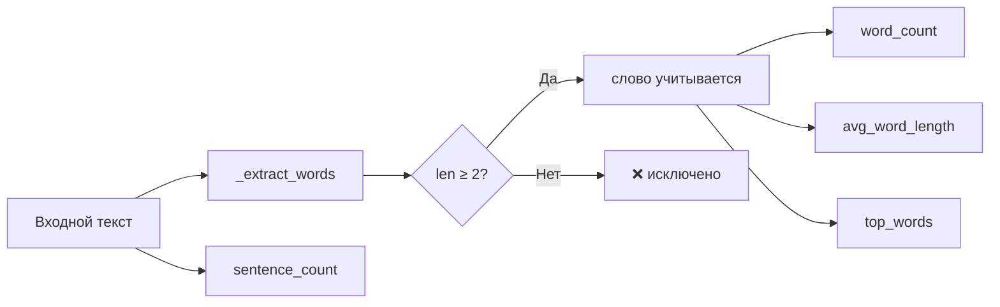

# text_stats

Библиотека на Python для подсчёта статистики текста.
Поддержка кириллицы и латиницы, работа через pipe из командной строки Windows.

## Функции

| Функция | Описание |
|---------|----------|
| `word_count(text)` | Количество слов (длиной от 2 символов) |
| `sentence_count(text)` | Количество предложений по `.!?` |
| `avg_word_length(text)` | Средняя длина слова (0.0, если слов нет) |
| `top_words(text, n=5)` | Топ-N самых частых слов в виде `list[tuple[str, int]]` |

### Фильтрация токенов

Однобуквенные токены (предлоги **в, к, о, с, у**, союзы **а, и**, частицы и др.)
исключаются из всех подсчётов. Порог задаётся константой `_MIN_WORD_LEN = 2`.

Двухбуквенные предлоги (**на, за, из, от, по**) — учитываются.

### Поток данных



## Установка

```cmd
git clone <repo-url>
cd text_stats
pip install -e .
```

Или без установки — просто скопируйте `text_stats.py` в проект.

## Использование

### Как модуль

```python
from text_stats import word_count, sentence_count, avg_word_length, top_words

text = "Привет, мир! Это тест."

print(word_count(text))        # 4
print(sentence_count(text))    # 2
print(avg_word_length(text))   # 3.5
print(top_words(text))         # [('привет', 1), ('мир', 1), ('это', 1), ('тест', 1)]
```

### Из командной строки (Windows)

```cmd
type text.txt | python text_stats.py
```

Вывод:

```
Слов: 175
Предложений: 10
Средняя длина слова: 7.5
Топ-5 слов:
  что: 3
  быть: 3
  на: 2
  из: 2
  не: 2
```

## Тесты

```cmd
python -m pytest tests/test_stats.py -v
```

25 тестов покрывают все публичные функции:

- `word_count` — простой текст, пустая строка, пунктуация, кириллица, смешанный
- `sentence_count` — точки, `!`, `?`, смешанные, пустая, без знака, многоточие
- `avg_word_length` — простой, пустой, одно слово, кириллица
- `top_words` — по умолчанию, кастомный n, пустой, регистр, кириллица
- Фильтрация — исключение однобуквенных токенов из word_count, avg_word_length, top_words

## Требования

- Python 3.11+
- Зависимости: только стандартная библиотека (`re`, `collections`)
- Для тестов: `pytest`

## Структура проекта

```
text_stats.py          # основной модуль
text.txt               # пример текста для pipe
tests/
  test_stats.py        # тесты (25 шт.)
README.md
```
