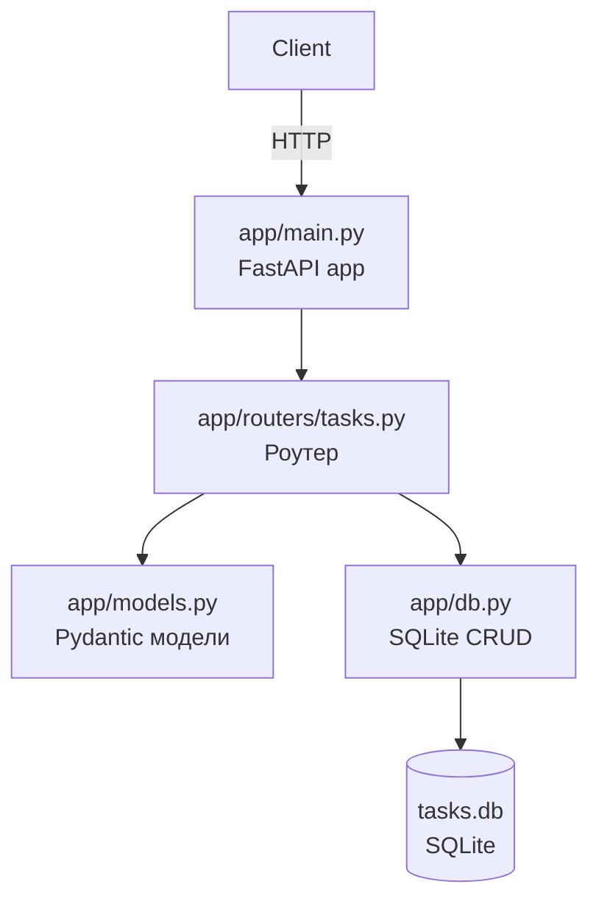
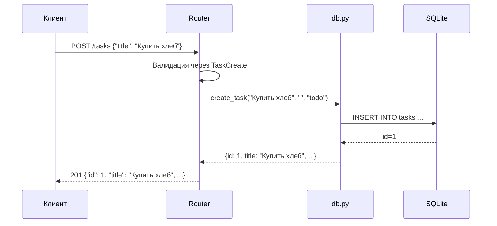

# План реализации ToDo REST API

## Обзор проекта

Простое REST API для управления списком задач на **FastAPI** с хранением в **SQLite**. Проект создаётся с нуля в директории `task_03`.

---

## Архитектура



---

## Структура файлов

```text
task_03/
├── pyproject.toml          # Зависимости и настройки
├── app/
│   ├── __init__.py
│   ├── main.py             # Точка входа, создание FastAPI
│   ├── models.py           # Pydantic-модели
│   ├── db.py               # Инициализация БД и CRUD-операции
│   └── routers/
│       ├── __init__.py
│       └── tasks.py        # Эндпоинты задач
└── tests/
    ├── __init__.py
    └── test_api.py         # Тесты через TestClient
```

---

## Зависимости

| Пакет | Версия | Назначение |
|-------|--------|------------|
| `fastapi` | `^0.115` | Веб-фреймворк |
| `uvicorn` | `^0.34` | ASGI-сервер |
| `pydantic` | `^2.0` | Валидация данных |
| `pytest` | `^8.0` | Тестирование |
| `httpx` | `^0.28` | TestClient |
| `ruff` | `^0.8` | Линтер |
| `black` | `^24.0` | Форматирование |

---

## Описание файлов

### 1. `pyproject.toml` — зависимости и настройки

Объявляет все зависимости (см. таблицу выше) и настройки `ruff` / `black`.

---

### 2. `app/models.py` — Pydantic-модели

```python
from datetime import datetime
from enum import Enum

from pydantic import BaseModel, Field


class TaskStatus(str, Enum):
    """Статус задачи."""

    todo = "todo"
    in_progress = "in_progress"
    done = "done"


class TaskCreate(BaseModel):
    """Схема для создания задачи."""

    title: str = Field(..., min_length=1, max_length=200)
    description: str = Field(default="", max_length=1000)
    status: TaskStatus = Field(default=TaskStatus.todo)


class TaskUpdate(BaseModel):
    """Схема для обновления задачи — все поля опциональны."""

    title: str | None = Field(default=None, min_length=1, max_length=200)
    description: str | None = Field(default=None, max_length=1000)
    status: TaskStatus | None = Field(default=None)


class TaskRead(BaseModel):
    """Схема ответа с id и метками времени."""

    id: int
    title: str
    description: str
    status: TaskStatus
    created_at: datetime
    updated_at: datetime
```

**Зависит от:** `pydantic`

---

### 3. `app/db.py` — SQLite-слой

#### Инициализация

```python
import sqlite3
from datetime import datetime

DB_PATH = "tasks.db"


def get_connection() -> sqlite3.Connection:
    """Возвращает соединение с БД."""
    conn = sqlite3.connect(DB_PATH)
    conn.row_factory = sqlite3.Row
    return conn


def init_db() -> None:
    """Создаёт таблицу tasks, если не существует."""
    with get_connection() as conn:
        conn.execute("""
            CREATE TABLE IF NOT EXISTS tasks (
                id INTEGER PRIMARY KEY AUTOINCREMENT,
                title TEXT NOT NULL,
                description TEXT NOT NULL DEFAULT '',
                status TEXT NOT NULL DEFAULT 'todo',
                created_at TEXT NOT NULL,
                updated_at TEXT NOT NULL
            )
        """)
```

#### CRUD-функции

| Функция | Описание |
|---------|----------|
| `create_task(title, description, status)` | INSERT → возвращает id |
| `get_all_tasks()` | SELECT * → список словарей |
| `get_task_by_id(task_id)` | SELECT WHERE id → словарь или None |
| `update_task(task_id, **fields)` | UPDATE только переданных полей → словарь или None |
| `delete_task(task_id)` | DELETE → bool (успешно ли) |

**Зависит от:** `sqlite3`, `app.models`

---

### 4. `app/routers/tasks.py` — эндпоинты

```python
from fastapi import APIRouter, HTTPException, status

from app import db
from app.models import TaskCreate, TaskRead, TaskUpdate

router = APIRouter(prefix="/tasks", tags=["tasks"])
```

#### Маршруты

| Метод | Путь | Код ответа | Описание |
|-------|------|------------|----------|
| `POST` | `/tasks` | 201 | Создать задачу |
| `GET` | `/tasks` | 200 | Получить все задачи |
| `PUT` | `/tasks/{id}` | 200 | Обновить задачу |
| `DELETE` | `/tasks/{id}` | 204 | Удалить задачу |

#### Логика ошибок

- `GET /tasks/{id}`, `PUT /tasks/{id}`, `DELETE /tasks/{id}` → **404** с `{"detail": "Task not found"}` при отсутствии записи
- `PUT` — частичное обновление: обновляются только переданные поля, `updated_at` всегда обновляется

**Зависит от:** `fastapi`, `app.models`, `app.db`

---

### 5. `app/main.py` — сборка приложения

```python
from fastapi import FastAPI

from app.db import init_db
from app.routers import tasks

app = FastAPI(title="ToDo API", version="1.0.0")


@app.on_event("startup")
def startup() -> None:
    """Инициализация БД при старте."""
    init_db()


app.include_router(tasks.router)
```

**Зависит от:** `fastapi`, `app.routers.tasks`, `app.db`

---

### 6. `tests/test_api.py` — тесты

Используется `TestClient` из `fastapi.testclient` (на базе `httpx`).

| Тест | Что проверяет |
|------|---------------|
| `test_create_task` | POST /tasks → 201, тело содержит id и title |
| `test_get_tasks_empty` | GET /tasks → 200, пустой список |
| `test_get_tasks_after_create` | Создаём 2 задачи, GET → список из 2 |
| `test_get_task_by_id` | POST, затем GET /tasks/{id} → совпадает title |
| `test_get_task_not_found` | GET /tasks/999 → 404 |
| `test_update_task` | PUT /tasks/{id} с новым title → обновлено |
| `test_update_task_partial` | PUT только status → title не изменился |
| `test_update_task_not_found` | PUT /tasks/999 → 404 |
| `test_delete_task` | DELETE /tasks/{id} → 204, повторный GET → 404 |
| `test_delete_task_not_found` | DELETE /tasks/999 → 404 |

**Фикстура:** `tmp_path` для изоляции БД в каждом тесте (переопределение `db.DB_PATH`).

**Зависит от:** `pytest`, `httpx`, `app.main`

---

## Поток данных при создании задачи



---

## Порядок реализации

1. **`pyproject.toml`** — объявить зависимости и настройки ruff/black
2. **`app/models.py`** — описать Pydantic-модели (`TaskCreate`, `TaskUpdate`, `TaskRead`, `TaskStatus`)
3. **`app/db.py`** — реализовать `init_db()` и CRUD-функции
4. **`app/routers/tasks.py`** — реализовать 4 эндпоинта с валидацией и обработкой 404
5. **`app/main.py`** — собрать FastAPI-приложение, подключить роутер и `init_db`
6. **`tests/test_api.py`** — написать 10 тестов с изолированной БД
7. **Проверка:** `ruff check .`, `black --check .`, `pytest -v`

---

## Чеклист соответствия AGENTS.md

- [x] Python 3.11+ с type hints
- [x] Форматирование black, линтер ruff
- [x] Docstring для каждой функции
- [x] Тесты на pytest в `tests/test_api.py`
- [x] Импорты: встроенные → сторонние → локальные
- [x] Структура файлов: `app/main.py`, `app/models.py`, `app/db.py`, `app/routers/tasks.py`, `tests/test_api.py`
